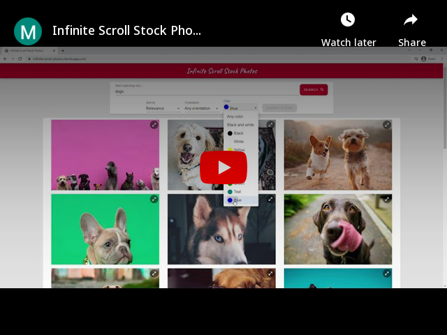

# Infinite Scroll Stock Photos - React application

<h4>An image gallery that fetches data from Unsplash API. It has some awesome features like searching for images, apply filters (sort by, orientation and color) and infinite scrolling in which images keeps on loading as the user scrolls.</h4>


<p align="center">

  
</p>
<p align="center">
  <a href="https://www.youtube.com/watch?v=WmdbM44LBUU"></a>
</p>

## Website

https://infinite-scroll-photos.herokuapp.com/

## Features

- Search images
- Apply filters (sort, orientation, color)
- Infinite scrolling
- Animations

## Usage

### Install Dependencies (Client & Server)

```
npm install
```

### Run

```
npm start
```

## Build

```
npm run build
```
