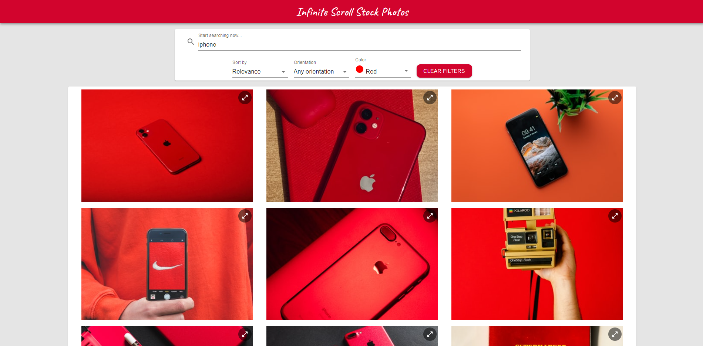
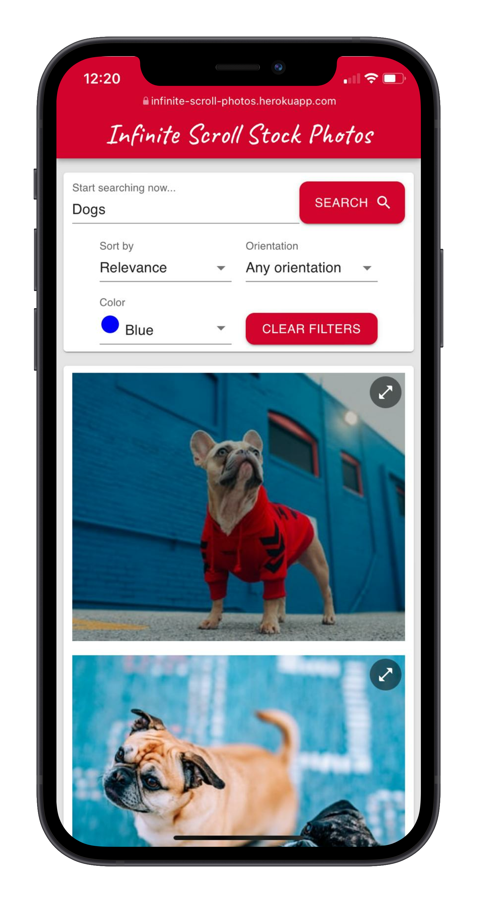
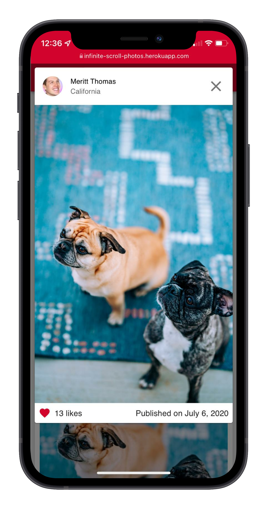

# Infinite Scroll Stock Photos - React application

> An image gallery that fetches data from Unsplash API


<p align="center">

  
</p>

## Website

https://infinite-scroll-photos.herokuapp.com/

## Features

- Search images
- Apply filters (sort, orientation, color)
- Infinite scrolling
- Animations

## Usage

### Install Dependencies (Client & Server)

```
npm install
```

### Run

```
npm start
```

## Build

```
npm run build
```
